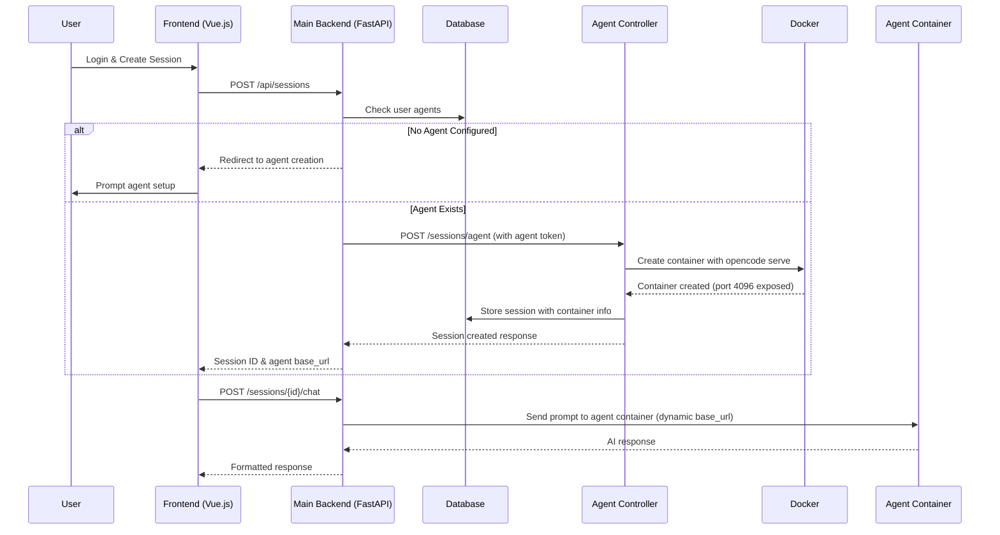

# Agent Session Feature Development Plan

## Overview

Implement a feature where users can create personalized agent sessions using their configured agents instead of the shared OpenCode service. When a user creates a new session, the system will:

1. Check if the user has a configured agent
2. If no agent exists, prompt user to create one
3. If agent exists, create a session using the agent's token and run a dedicated container
4. Use the agent's container (running on custom port) instead of the shared OpenCode service

## Current Architecture

- **Main Backend** (`app/main.py`): FastAPI app handling user auth, sessions, and chat
- **Agent Controller** (`app/agent-controller.py`): Separate service managing Docker containers
- **OpenCode API**: External service (port 4096) for AI interactions
- **Database**: SQLite with User-Agent-Session relationships
- **Frontend**: Vue.js app communicating with backend

## Requirements

### Functional Requirements
- User authentication and agent configuration check during session creation
- Automatic agent container creation and management per session
- Dynamic API routing to agent-specific containers
- Fallback to shared service if no agent configured
- Proper cleanup of agent containers when sessions end

### Technical Requirements
- Agent containers must expose port 4096 and run `opencode serve`
- Dynamic base_url support in OpenCode client
- Secure token handling for agent authentication
- Container isolation per user session
- Port management to avoid conflicts

## Implementation Steps

### Phase 1: Infrastructure Updates
1. **Update docker_ops.py**
   - Modify `run_session_container` to accept agent token
   - Add command to run `opencode serve` in containers
   - Ensure port 4096 is exposed and mapped dynamically
   - Use container naming strategy: `agent_{session_id}`
   - Join containers to `opencode-network`

2. **Setup Docker Networking**
   - Create `opencode-network` in docker-compose.yml
   - Configure all services to use the network
   - Update docker_ops.py to specify network on container creation

3. **Update opencode_client.py**
   - Add `base_url` parameter to service methods
   - Support per-session API endpoints using container DNS
   - Maintain backward compatibility with shared service

### Phase 2: Backend Logic Updates
3. **Modify Session Creation Flow**
   - In `main.py`, check user agents before creating session
   - Route to agent controller if agent exists
   - Handle agent creation prompts if no agent configured

4. **Enhance Agent Controller**
   - Add agent-specific session creation endpoints
   - Integrate agent tokens into container environment
   - Manage per-agent container lifecycle

### Phase 3: Database and Models
5. **Update Session Models**
   - Add `agent_id` field to sessions
   - Include custom port and container info
   - Update schemas for agent session responses

### Phase 4: Integration and Testing
6. **Update Chat Flow**
   - Modify chat endpoints to use agent-specific base_url
   - Handle dynamic routing based on session type

7. **Testing**
   - Test complete user flow: login → agent check → session creation → chat
   - Verify container isolation and cleanup
   - Test fallback scenarios

## Files to Modify

### Core Files
- `app/main.py`: Session creation logic and routing
- `app/agent-controller.py`: Agent session management
- `app/core/docker_ops.py`: Container operations for agents
- `app/core/opencode_client.py`: Dynamic API client
- `app/core/models.py`: Database models for agent sessions
- `app/core/schemas.py`: Response schemas

### Backend Files
- `app/backend/routes.py`: Container management routes
- `app/backend/apis.py`: Service classes (if needed)

### Configuration
- `docker-compose.yml`: Add `opencode-network` and update service configurations
  - Create bridge network for inter-service communication
  - Ensure backend and agent-controller join the network
  - Configure network aliases if needed
- Environment variables for port management and network settings

## API Changes

### New Endpoints
- `POST /api/sessions` (enhanced): Check agents and route accordingly
- `POST /agent-controller/sessions/agent`: Create agent-based sessions

### Modified Endpoints
- `POST /api/sessions/{id}/chat`: Use dynamic base_url
- Container management endpoints: Support agent containers

## Security Considerations

- Agent tokens must be securely stored and transmitted
- Container isolation to prevent cross-user access
- Service secret validation for agent controller
- Proper cleanup to prevent resource leaks

## Testing Strategy

1. **Unit Tests**: Individual component testing
2. **Integration Tests**: End-to-end session creation flow
3. **Container Tests**: Verify agent container functionality
4. **Security Tests**: Token handling and isolation

## Rollout Plan

1. Deploy infrastructure changes first
2. Enable feature flag for gradual rollout
3. Monitor container resource usage
4. A/B test with subset of users
5. Full rollout after validation

## Success Metrics

- Successful agent session creation rate
- Chat response times with agent containers
- Container resource utilization
- User satisfaction with personalized agents

## Risks and Mitigations

- **Port Conflicts**: Implement dynamic port allocation
- **Resource Exhaustion**: Add container limits and cleanup
- **API Compatibility**: Maintain backward compatibility
- **Performance Impact**: Monitor and optimize container startup time

## Architecture & Flow Diagram

### UML Sequence Diagram



### Network Architecture

```
┌─────────────────┐    ┌─────────────────┐    ┌─────────────────┐
│   Frontend      │    │   Main Backend  │    │ Agent Controller│
│   (Vue.js)      │    │   (FastAPI)     │    │   (FastAPI)     │
│                 │    │                 │    │                 │
│ Port: 3000      │◄──►│ Port: 8000      │◄──►│ Port: 8001      │
└─────────────────┘    └─────────────────┘    └─────────────────┘
                                │                        │
                                ▼                        ▼
                       ┌─────────────────┐    ┌─────────────────┐
                       │   Database      │    │     Docker      │
                       │   (SQLite)      │    │   Engine        │
                       └─────────────────┘    └─────────────────┘
                                                     │
                                                     ▼
┌─────────────────────────────────────────────────────────────┐
│                    Docker Network                           │
│  ┌─────────────────┐  ┌─────────────────┐  ┌─────────────┐  │
│  │ Agent Container │  │ Agent Container │  │  Shared     │  │
│  │ (Session 1)     │  │ (Session 2)     │  │ OpenCode    │  │
│  │ opencode serve  │  │ opencode serve  │  │ Service     │  │
│  │ Port: 4096      │  │ Port: 4096      │  │ Port: 4096  │  │
│  │ DNS: agent_123  │  │ DNS: agent_456  │  │             │  │
│  └─────────────────┘  └─────────────────┘  └─────────────┘  │
└─────────────────────────────────────────────────────────────┘
```

## Networking & DNS Resolution

### Docker Network Setup

To enable communication between backend services and agent containers, we need to establish proper Docker networking:

#### 1. Docker Network Configuration
- Create a dedicated Docker network: `opencode-network`
- All services (backend, agent-controller, agent containers) join this network
- Enables DNS resolution between containers using container names

#### 2. Container Naming Strategy
- Agent containers use predictable names: `agent_{session_id}`
- Backend can resolve containers via DNS: `http://agent_{session_id}:4096`
- Example: Session `abc123` → `http://agent_abc123:4096`

#### 3. Port Management
- Agent containers expose port 4096 internally
- No external port mapping needed (internal network only)
- Prevents port conflicts and enhances security

#### 4. Network Commands
```yaml
# docker-compose.yml updates
networks:
  opencode-network:
    driver: bridge

services:
  backend:
    networks:
      - opencode-network
  
  agent-controller:
    networks:
      - opencode-network
  
  # Agent containers created dynamically
  # Will join opencode-network automatically
```

#### 5. DNS Resolution Flow
1. Agent controller creates container with name `agent_{session_id}`
2. Container joins `opencode-network` and starts `opencode serve`
3. Backend receives session info with container name
4. Chat requests use `base_url = f"http://agent_{session_id}:4096"`
5. Docker DNS resolves the name to container IP automatically

### Alternative Approaches

#### Dynamic Port Mapping
- Map container port 4096 to random host ports
- Store mapped ports in database
- Backend uses `http://localhost:{mapped_port}`
- **Cons**: Port management complexity, potential conflicts

#### Service Discovery
- Use etcd, Consul, or similar for service registration
- Agent controller registers containers on startup
- Backend queries service discovery for endpoints
- **Pros**: Scalable, flexible
- **Cons**: Additional infrastructure complexity

### Recommended Approach
Use Docker network with container naming for simplicity and reliability. This leverages Docker's built-in DNS and doesn't require external port management.

## Implementation Notes

### Dynamic Base URL Construction
When an agent session is created, the backend will:

1. Receive session info from agent controller including container name
2. Construct base_url: `f"http://agent_{session_id}:4096"`
3. Store this in session metadata for chat operations
4. Use Docker's internal DNS resolution for container-to-container communication

### Container Lifecycle Management
- Agent containers are created on-demand per session
- Containers are automatically cleaned up when sessions end
- Network isolation ensures security between user sessions
- Resource limits prevent abuse (CPU, memory constraints)

### Fallback Strategy
- If agent container fails to start, fallback to shared OpenCode service
- Graceful degradation maintains service availability
- Error logging for troubleshooting container issues